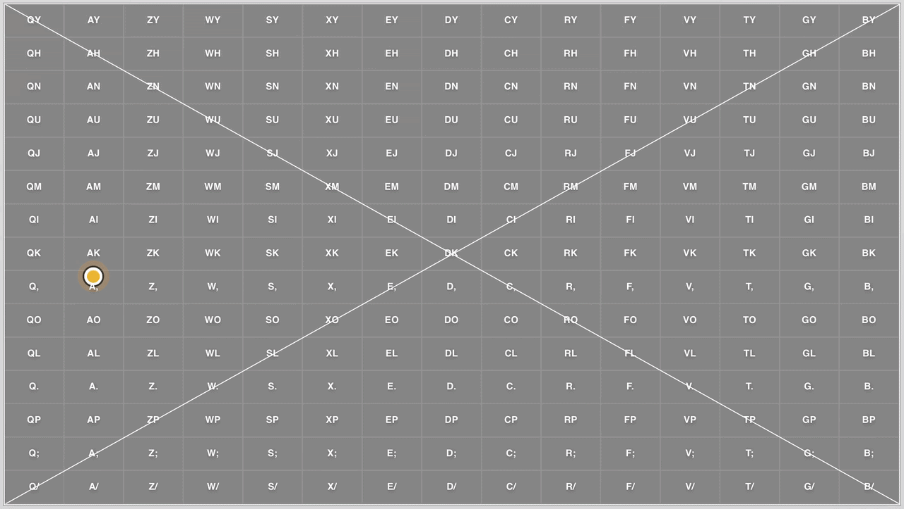
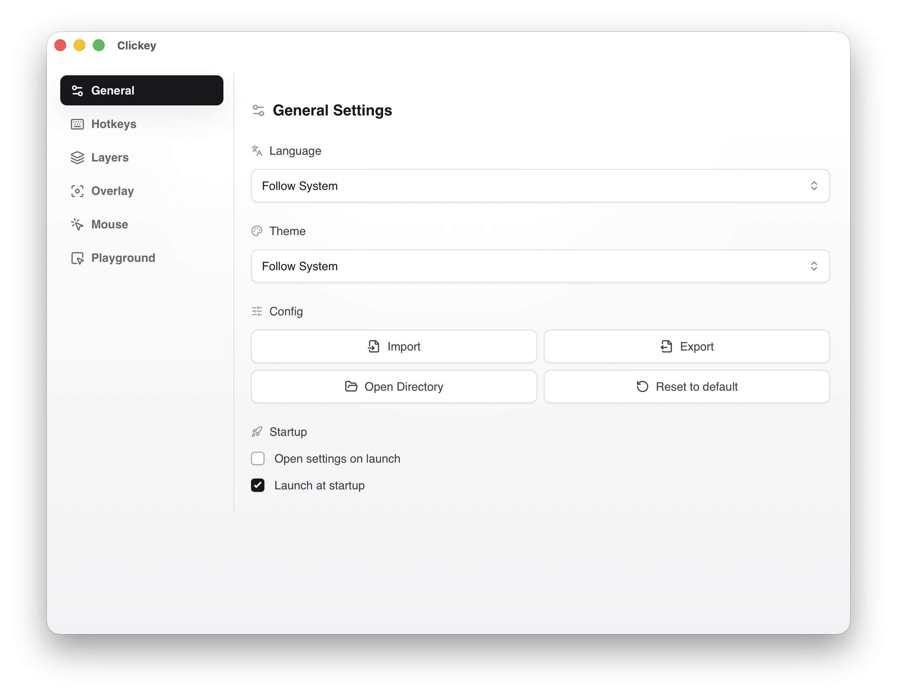
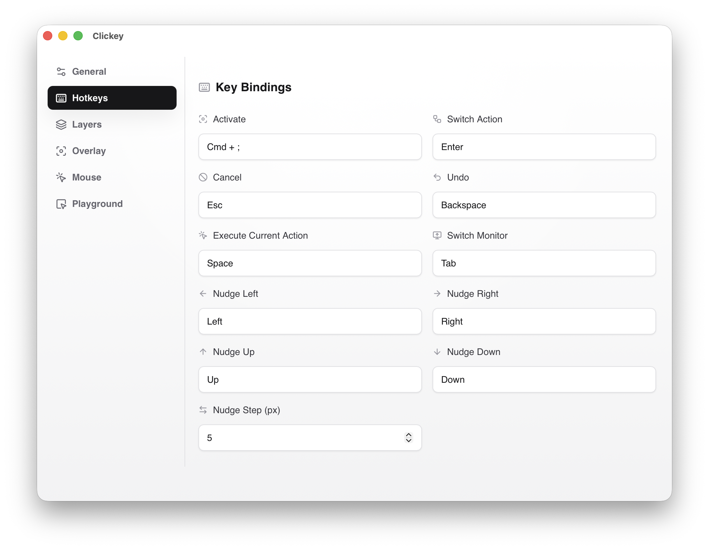
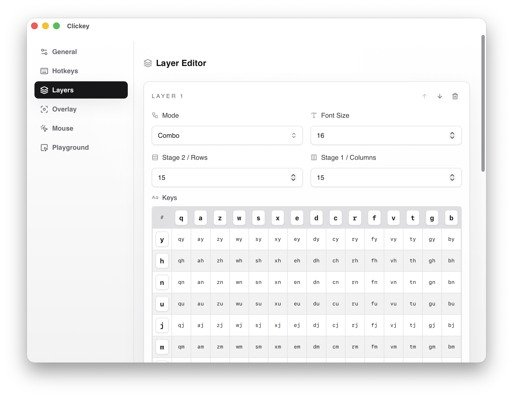
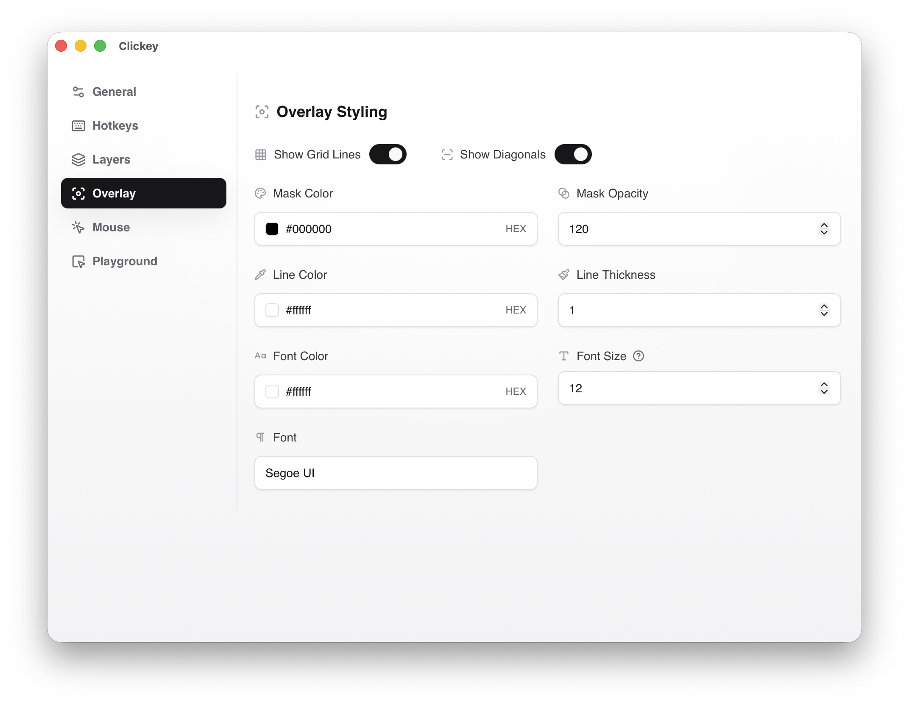
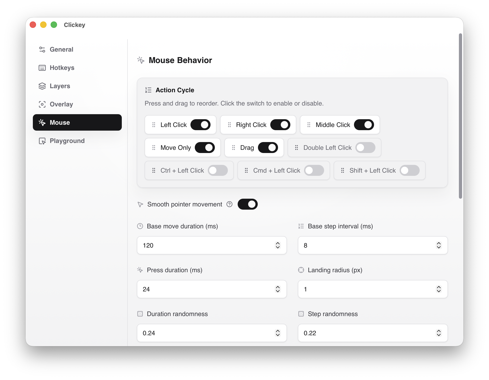

# Clickey

<a href="./README.md">简体中文</a> · <strong>English</strong>

Use layered grids and muscle memory to reduce back-and-forth switching between keyboard and mouse.

## ✨ Highlights

- Keyboard-driven layered grid targeting that narrows the cursor region in multiple steps.
- Supports left, right, middle, move-only, and two-phase drag actions; double-click and modifier-assisted clicks can be enabled when needed.
- Supports undo, cancel, direct execution, region nudging, and monitor switching.
- Includes a full Settings window for layers, hotkeys, mouse behavior, overlay appearance, language, and launch options.
- Persists configuration as "defaults + override JSON", with import, export, open-directory, and reset actions.
- Includes a local Playground so you can practice without triggering native mouse input.

## ⚡ Default Flow

1. Press the activation hotkey to open the overlay on the display currently under the cursor.
2. Press the keys for the current layer to keep shrinking the region.
3. Use `Enter` to switch actions, Arrow keys to nudge the region, and `Backspace` to undo when needed.
4. Continue through the remaining layers, or press `Space` to execute at the center of the current region.
5. If the current action is `drag`, select the start point first, then the end point, and Clickey performs a left-button drag.

When the overlay opens, the initial action is the first action in `mouse.actionCycle` that is not disabled by `mouse.disabledActions`. The default order is: left -> right -> middle -> move-only -> drag.

The default layer layout follows the v3.1 approach: first use a two-stage combo layer to choose among 15 columns and 15 rows, then use a final 3x5 single-key grid for fine targeting. Nudging works in every layer and stage.

## ⚙️ Settings and Config

Settings already covers the main entry points for daily use. Left-clicking the tray icon toggles the Settings window, and the right-click menu provides `Settings / Pause (or Start) / Quit`. 
 
The General page handles language, theme, launch options, and the `Import / Export / Open Directory / Restore Defaults` actions. 
 
The Hotkeys page lets you record activation and control keys, with conflict detection built in. 
 
Layers can be added, removed, reordered, switched between `single` and `combo`, edited in tables, and configured with per-layer font sizes. 
 
The Overlay page controls opacity, colors, line width, fonts, and whether grid lines and diagonals are shown. 
 
The Mouse page manages action order, enabled states, smooth movement, randomized landing, curve, jitter, and step strategy.

Configuration is persisted as override JSON. `settings.override.json` only stores values that differ from the defaults, and `Open Directory` opens the config location directly.

## 🛠️ Run and Build

### Run from Source

1. Install Node.js, Rust, and the system dependencies required by Tauri v2.
2. Install dependencies: `npm install`
3. Start the development app: `npm run tauri:dev`

### Build

- Build the desktop app: `npm run tauri:build`
- Build the frontend only: `npm run build`

### Common Checks

- Tests: `npm test`
- Type checking: `npm run check`
- ESLint: `npm run lint`
- Formatting: `npm run format`

## 🍎 macOS Notes

- `tauri dev` and the packaged `Clickey.app` are separate TCC identities on macOS. Working in development does not mean the installed app is already authorized.
- If the installed app can open the overlay but cannot move or click the mouse, move `Clickey.app` to `/Applications`, then re-authorize it in `System Settings > Privacy & Security > Accessibility`.
- If the activation hotkey also does not work, check `Input Monitoring` as well.
- `npm run tauri:build` automatically looks for signing certificates in this order: `Developer ID Application` -> `Apple Distribution` -> `Apple Development`; if none are found, it falls back to ad-hoc signing with `"-"`.
- On macOS, only `F1` through `F20` can currently be registered as global hotkeys; `F21` through `F24` are unavailable.

## 🧩 Architecture

- Core Engine (TypeScript): a pure state machine for key progression, region cropping, undo, direct execution, and nudging.
- Overlay Renderer (Svelte): renders the overlay only; it does not take focus or read keyboard input.
- Settings UI (Svelte): config editing, override JSON import/export, and the local Playground.
- Native Layer (Rust): global hotkeys, monitor information, mouse movement, and clicks.
- Desktop Shell (Tauri): windows, tray integration, config delivery, and frontend/native communication.

## 📦 Historical Reference

The `demo/` directory keeps earlier prototypes only for reviewing past interaction ideas and behavior comparisons. It does not define the current product. See `demo/clickey.md` when needed.

## 🤝 Development

If you are contributing code, use the repository code and the current default config as the source of truth. If another model or agent will continue the work, read `AGENTS.md` first.
