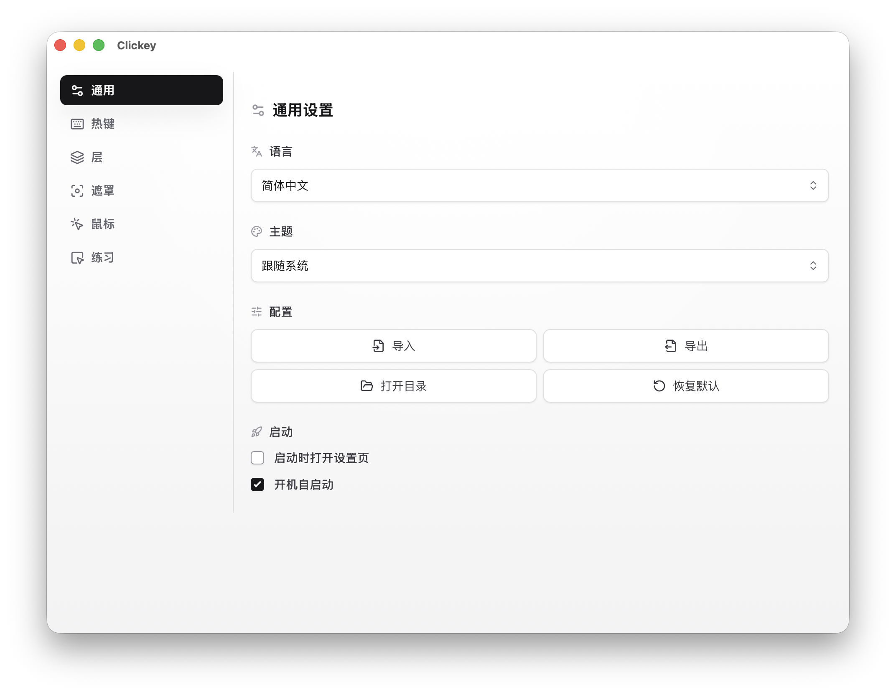
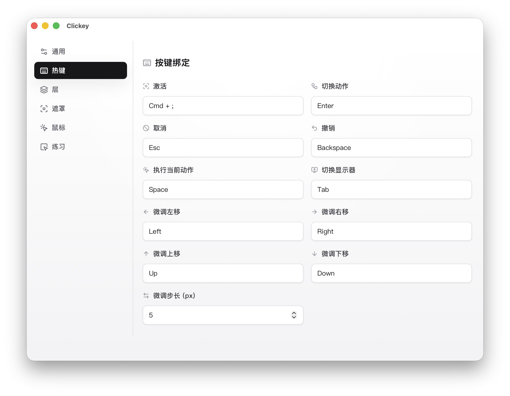
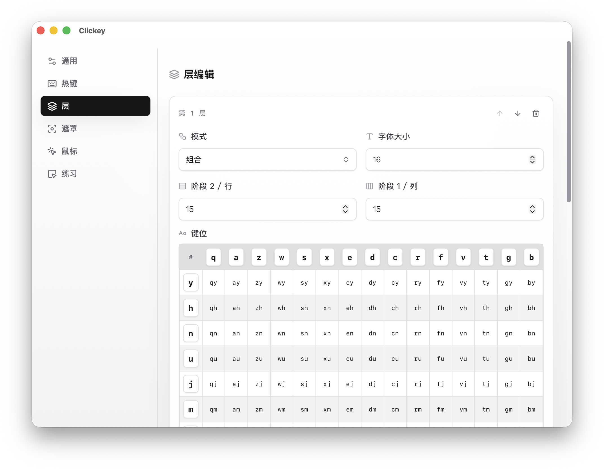
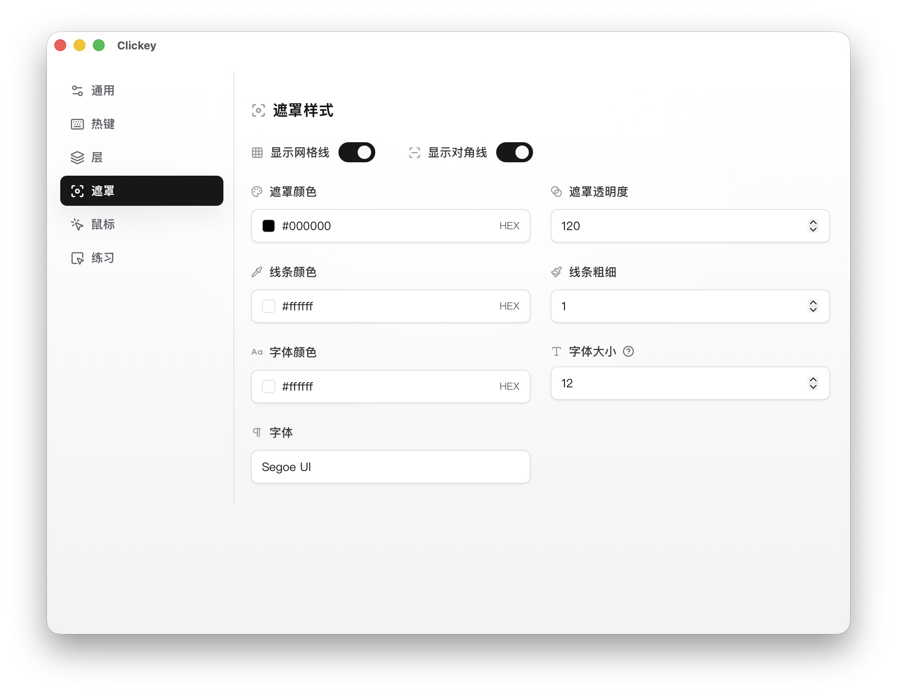
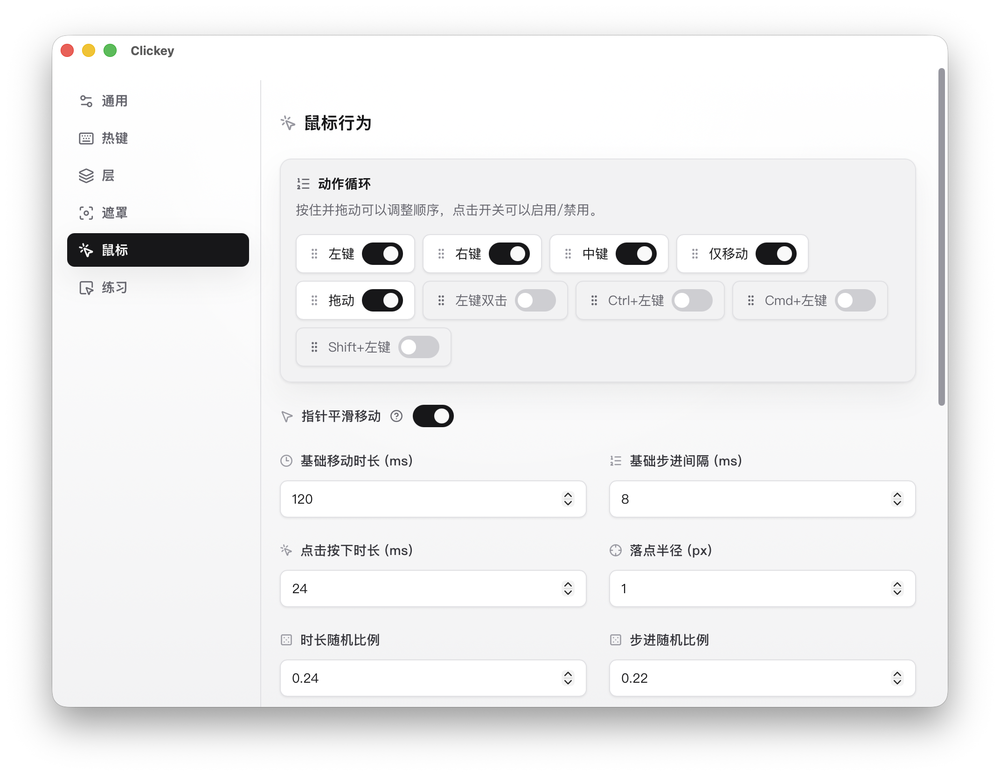

# Clickey

<strong>简体中文</strong> · <a href="./README.en.md">English</a>

用分层网格和肌肉记忆，减少手腕在鼠标与键盘之间来回切换。

## ✨ 功能概览

- 键盘驱动的分层网格定位，支持多步收缩到小目标区域。
- 支持左键、右键、中键、仅移动、两段式拖动；左键双击与修饰键点击可按需启用。
- 支持撤销、取消、直达执行、区域微调、多显示器切换。
- 提供完整 Settings 窗口，可编辑 layers、热键、鼠标行为、遮罩样式、语言与启动项。
- 配置以“默认值 + override JSON”方式持久化，支持导入、导出、打开配置目录与恢复默认。
- 内置 Playground 练习区，可在不调用系统鼠标能力的前提下熟悉当前配置。

## ⚡ 默认使用流程

1. 按激活热键，Overlay 在鼠标当前所在显示器上打开；再次按相同激活热键会取消当前会话，不执行任何动作。
2. 按当前层对应的键，逐步把 Region 缩小到目标附近。
3. 如有需要，用 `Enter` 切换动作，用 Arrow 微调区域，用 `Backspace` 撤销上一步。
4. 到达满意精度后，继续完成后续层级，或直接按 `Space` 执行当前区域中心点动作。
5. 如果当前动作是 `drag`，会先选择起点，再选择终点，最后执行一次左键拖动。

激活 Overlay 时，初始动作来自 `mouse.actionCycle` 中第一个未被 `mouse.disabledActions` 禁用的动作。默认顺序是：左键 -> 右键 -> 中键 -> 仅移动 -> 拖动。

默认层级方案沿用 v3.1 的思路：先用 combo 两段式选择 15 列和 15 行，再用一层 3x5 单键网格做最后一次精细裁剪。所有层与阶段都支持微调。

## ⚙️ Settings 与配置

Settings 已经覆盖正式使用需要的主要入口，托盘左键可切换设置页显隐，右键菜单提供 `设置 / 暂停(或启动) / 退出`。 
 
通用页负责语言、主题、启动项，以及 `导入 / 导出 / 打开目录 / 恢复默认` 这些配置操作。 
 
热键页支持录制激活键和控制键，也会做冲突检测。 
 
Layers 支持增删、上下移动、`single/combo` 切换、表格化键位编辑和按层字体大小设置。 
 
Overlay 页集中调整透明度、颜色、线宽、字体，以及网格线和对角线显示。 
 
Mouse 页负责动作顺序与启用状态，以及平滑移动、随机落点、曲率、抖动和步进策略。

配置以 override JSON 持久化，`settings.override.json` 只记录与默认配置不同的字段。Settings 的“打开目录”会直接打开配置所在目录。

## 🛠️ 运行与构建

### 从源码运行

1. 安装 Node.js、Rust，以及 Tauri v2 对应的系统依赖。
2. 安装依赖：`npm install`
3. 启动开发环境：`npm run tauri:dev`

### 打包

- 构建桌面应用：`npm run tauri:build`
- 仅构建前端：`npm run build`

### 常用检查命令

- 单测：`npm test`
- 类型检查：`npm run check`
- ESLint：`npm run lint`
- 格式化：`npm run format`

## 🍎 macOS 注意事项

- `tauri dev` 与安装后的 `Clickey.app` 在 macOS TCC 里是两个不同身份；开发态能用，不代表安装态已经拿到权限。
- 如果安装后的版本能打开 Overlay、但不能移动或点击鼠标，请先把 `Clickey.app` 放到 `/Applications`，再到“系统设置 > 隐私与安全性 > 辅助功能”里重新授权。
- 如果激活热键也不生效，再额外检查“输入监控”权限。
- `npm run tauri:build` 会优先自动探测本机签名证书：`Developer ID Application` -> `Apple Distribution` -> `Apple Development`；未命中时会显式回退到 ad-hoc `"-"`。
- macOS 当前仅支持把 `F1` 到 `F20` 用作可注册的全局热键；`F21` 到 `F24` 不可用。

## 🧩 架构概览

- Core Engine（TypeScript）：纯逻辑状态机，负责按键推进、Region 裁剪、撤销、直达与微调。
- Overlay Renderer（Svelte）：只负责渲染遮罩，不抢焦点、不读键盘。
- Settings UI（Svelte）：配置编辑、override JSON 导入导出、本地 Playground。
- Native Layer（Rust）：全局热键、显示器信息、鼠标移动与点击。
- Desktop Shell（Tauri）：窗口、托盘、配置下发与前后端通信。

## 📦 历史参考

`demo/` 目录里保留了早期原型文件，只用于回看旧交互或做行为对照，不参与当前版本定义。需要时可查看 `demo/clickey.md`。

## 🤝 开发协作

如果你是开发者，直接以仓库里的代码和默认配置为准；如果你要让大模型或智能体接力维护，请先阅读 `AGENTS.md`。
